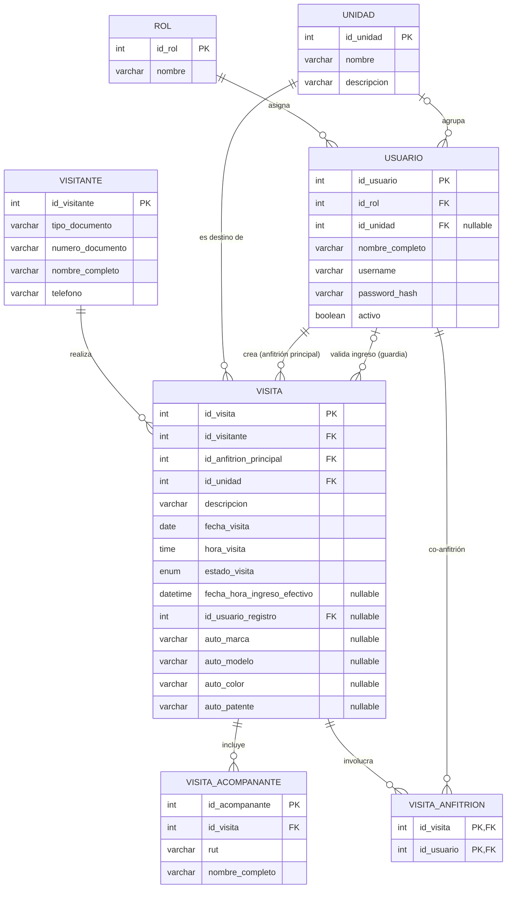
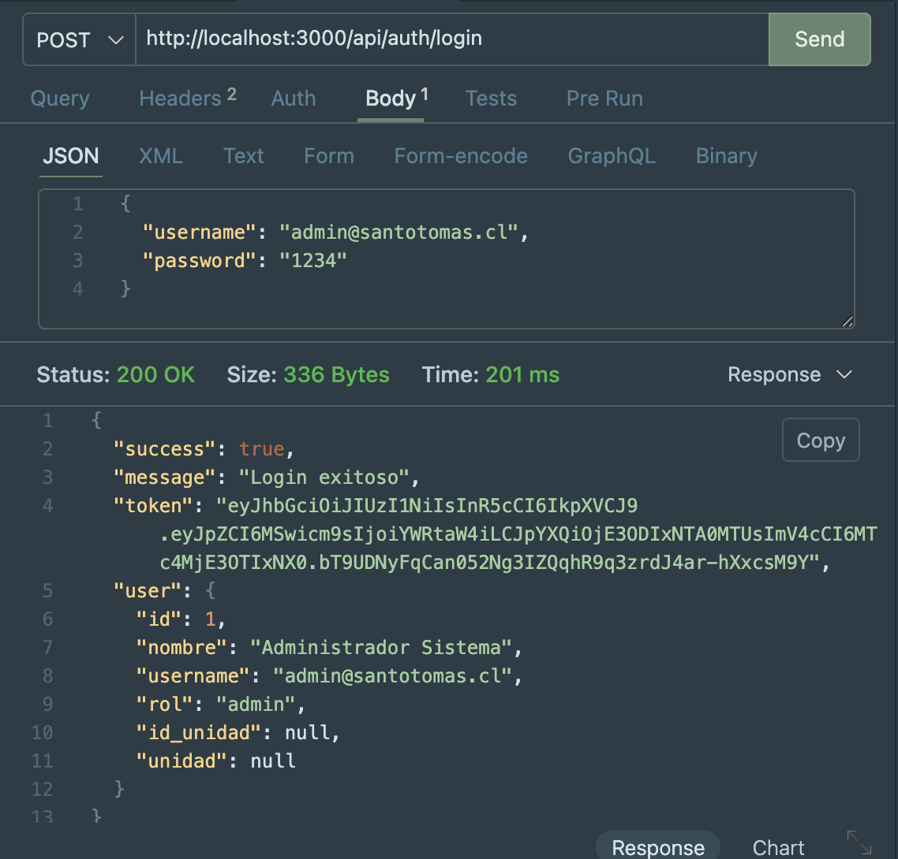
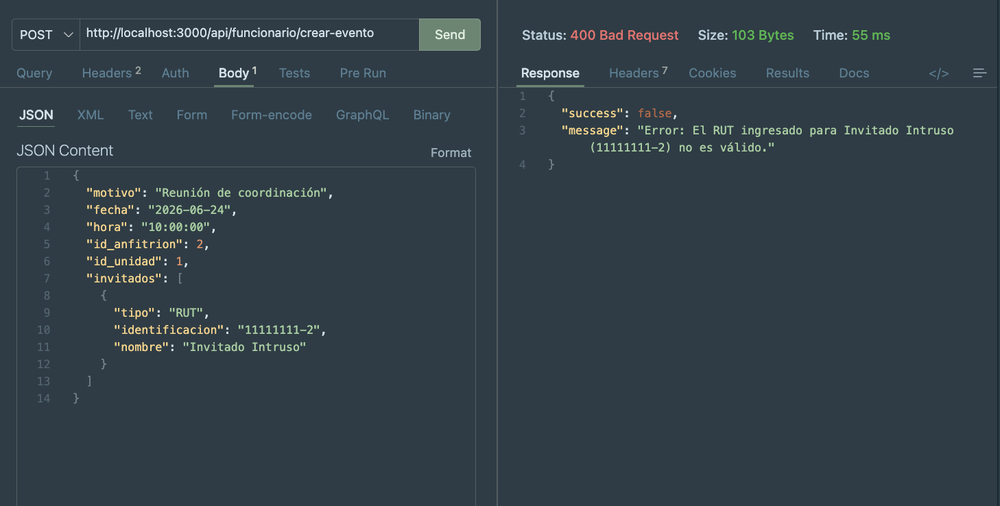
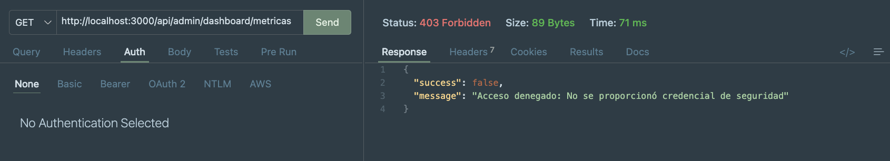

# Sistema de Registro y Control de Acceso - Sede San Joaquín

Este proyecto es una plataforma web full-stack diseñada para la gestión, control y auditoría del flujo de visitas vehiculares y peatonales de la institución. El sistema optimiza la comunicación entre tres perfiles clave de usuarios (Administradores, Funcionarios y Guardias de Seguridad), garantizando la integridad de los datos y la seguridad perimetral de la sede.

---

## 📋 Objetivo del Proyecto
El software resuelve la problemática del registro manual de visitas en portería mediante la digitalización del ciclo de vida de una asistencia: el funcionario pre-programa la invitación, el guardia valida el ingreso efectivo en tiempo real y la administración audita la operación a través de un panel analítico inteligente.


## 💻 Stack Tecnológico
El proyecto fue construido bajo una arquitectura de tres capas, utilizando las siguientes tecnologías:

* **Frontend (Capa de Presentación):** HTML5, CSS3, y Vanilla JavaScript (ES6+). Interfaz responsiva y manejo de estado a través de `sessionStorage`.
* **Backend (Capa de Negocio):** Node.js con el framework Express.js. API RESTful modularizada con controladores y middlewares independientes.
* **Base de Datos (Capa de Datos):** MySQL 8.0 relacional, utilizando el motor InnoDB para garantizar la integridad referencial.
* **Seguridad y Utilidades:** `jsonwebtoken` (JWT), `bcryptjs` (Hashing de claves), `node-cron` (Tareas en segundo plano).


---

## 🗄️ Diseño y Arquitectura de Base de Datos
El modelo de datos fue normalizado para evitar la redundancia y optimizar las consultas históricas. Las decisiones clave de diseño incluyen:
1. **Desacoplamiento de Entidades:** Se separó al `VISITANTE` (maestro de personas físicas) de la `VISITA` (evento transaccional). Esto permite que un mismo visitante ingrese múltiples veces en el futuro sin duplicar sus datos personales.
2. **Control de Accesos (RBAC):** La tabla `USUARIO` depende directamente de un `ROL` dinámico, limitando las acciones permitidas a nivel de base de datos.
3. **Relaciones N:M:** Se implementó una tabla puente (`VISITA_ANFITRION`) para resolver la cardinalidad de muchos a muchos, permitiendo que una visita sea recibida por múltiples co-anfitriones simultáneamente.

### Modelado de Base de Datos 



## 🛠️ Requisitos del Sistema
Antes de ejecutar la aplicación, asegúrese de contar con los siguientes componentes instalados en su entorno de desarrollo:

* **Entorno de Ejecución:** Node.js (v18 o superior recomendado)
* **Gestor de Entornos Node:** `nvm` (Node Version Manager) para el aislamiento de versiones globales.
* **Base de Datos:** MySQL Server 8.0 o superior.
* **IDE Recomendado:** Visual Studio Code o IntelliJ IDEA.

---

## 🚀 Instalación y Ejecución

### 1. Clonar el repositorio y acceder al directorio
```bash
git clone https://github.com/GGallegosO/ControlAccesoST
cd ControlAccesoST
```

### 2. Instalar dependencias locales

La instalación se realiza de forma estrictamente local dentro del entorno del proyecto para preservar la limpieza de las dependencias globales del sistema:

```bash
npm install
```

### 3. Configurar variables de entorno (.env)

Cree un archivo .env en la raíz del proyecto y configure los accesos de la base de datos junto con la clave criptográfica para los tokens de seguridad:

```bash
PORT=3000
DB_HOST=localhost
DB_USER=usuario_local
DB_PASSWORD=tu_password_local_aqui
DB_NAME=ControlAccesoST
JWT_SECRET=escribe_aqui_una_cadena_aleatoria_super_larga
```

### 4. Importar base de datos
Ejecute el script de base de datos provisto en su gestor MySQL (ej: MySQL Workbench) para crear el esquema, las vistas, los procedimientos almacenados y cargar los datos semilla institucionales.

### 5. Ejecutar en entorno de desarrollo
El sistema utiliza nodemon para refrescar los cambios del servidor en tiempo real de forma automática:


```bash
npm run dev
```

Acceda a la aplicación mediante su navegador web en http://localhost:3000.


---

## 🧠 Decisiones Técnicas y Arquitectura
* **Autenticación y Autorización Criptográfica (JWT):** Se implementó JSON Web Tokens para el manejo de sesiones de forma stateless (sin estado). Las rutas del backend están blindadas por un middleware que decodifica la firma digital del token, aplicando un Control de Acceso Basado en Roles (RBAC) estricto.
* **Protección de Credenciales (BcryptJS):** Las contraseñas de los usuarios institucionales nunca se almacenan en texto plano en la base de datos. Se utiliza el algoritmo de hash adaptativo bcryptjs con un factor de costo de 10 saltos.
* **Validación Dual de Identidad (Algoritmo Módulo 11):** Para asegurar la integridad de la base de datos, se programó un validador del RUT chileno. Este opera tanto en el Frontend (mejorando la experiencia de usuario) como en el Backend (actuando como última línea de defensa ante peticiones externas modificadas).
* **Automatización de Reglas de Negocio (node-cron):** Para evitar fallos operacionales humanos, se configuró una tarea programada (cron job) que se ejecuta en segundo plano de forma autónoma todas las noches a las 23:59 hrs, reclasificando automáticamente como NO_ASISTIO aquellas visitas pendientes del pasado.
* **Optimización de Capa de Datos (MySQL Views y Stored Procedures):** Las consultas pesadas del módulo del guardia y los cálculos de actualización masiva (como el ingreso grupal con herencia vehicular) fueron delegados directamente al motor de la base de datos mediante Procedimientos Almacenados y Vistas indexadas.

## 📊 Evidencias de Pruebas de API (Thunder Client)
Las siguientes trazas corresponden a los testeos realizados de forma interna en Visual Studio Code mediante la extensión Thunder Client, validando las respuestas del servidor frente a escenarios correctos y flujos alternativos de error.

### Evidencia 1: Autenticación Exitosa e Inicio de Sesión



### Evidencia 2: Rechazo por RUT Inválido (Capa de Seguridad del Backend)



### Evidencia 3: Intento de Acceso a Ruta Protegida sin Credenciales


